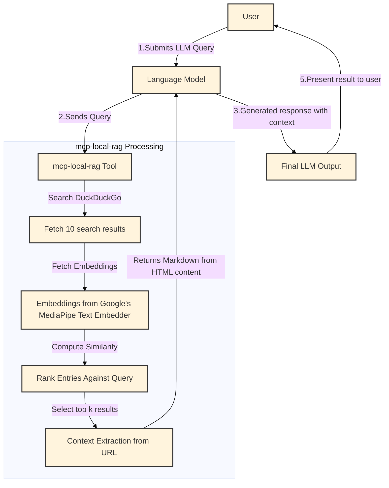

<a href='https://github.com/nkapila6/mcp-local-rag/'></a>

[](https://codespaces.new/nkapila6/mcp-local-rag)

<!-- omit from toc -->
# mcp-local-rag
"primitive" RAG-like web search model context protocol (MCP) server that runs locally. ✨ no APIs ✨

- [Installation](#installation)
    - [Run Directly via `uvx`](#run-directly-via-uvx)
    - [Using Docker (recommended)](#using-docker-recommended)
- [Security audits](#security-audits)
- [MCP Clients](#mcp-clients)
- [Examples on Claude Desktop](#examples-on-claude-desktop)
  - [Result](#result)
- [Contributing](#contributing)
- [License](#license)




# Installation
Locate your MCP config path [here](https://modelcontextprotocol.io/quickstart/user) or check your MCP client settings. 

### Run Directly via `uvx`
This is the easiest and quickest method. You need to install [uv](https://docs.astral.sh/uv/) for this to work. <br>
Add this to your MCP server configuration:
```json
{
  "mcpServers": {
    "mcp-local-rag":{
      "command": "uvx",
        "args": [
          "--python=3.10",
          "--from",
          "git+https://github.com/nkapila6/mcp-local-rag",
          "mcp-local-rag"
        ]
      }
  }
}
```

### Using Docker (recommended)
Ensure you have [Docker](https://www.docker.com) installed.<br>
Add this to your MCP server configuration:
```json
{
  "mcpServers": {
    "mcp-local-rag": {
      "command": "docker",
      "args": [
        "run",
        "--rm",
        "-i",
        "--init",
        "-e",
        "DOCKER_CONTAINER=true",
        "ghcr.io/nkapila6/mcp-local-rag:latest"
      ]
    }
  }
}
```

# Security audits
MseeP does security audits on every MCP server, you can see the security audit of this MCP server by clicking [here](https://mseep.ai/app/nkapila6-mcp-local-rag).

<a href='https://mseep.ai/app/nkapila6-mcp-local-rag'></a>

# MCP Clients
The MCP server should work with any MCP client that supports tool calling. Has been tested on the below clients.

- Claude Desktop
- Cursor
- Goose
- Others? You try!

# Examples on Claude Desktop
When an LLM (like Claude) is asked a question requiring recent web information, it will trigger `mcp-local-rag`.

When asked to fetch/lookup/search the web, the model prompts you to use MCP server for the chat.

In the example, have asked it about Google's latest Gemma models released yesterday. This is new info that Claude is not aware about.


## Result
`mcp-local-rag` performs a live web search, extracts context, and sends it back to the model—giving it fresh knowledge:


## Buy Me A Coffee
If the software I've built has been helpful to you. Please do buy me a coffee, would really appreciate it! 😄

[](https://ko-fi.com/X8X51MK4A1)

# Contributing
Have ideas or want to improve this project? Issues and pull requests are welcome!

# License
This project is licensed under the MIT License.
