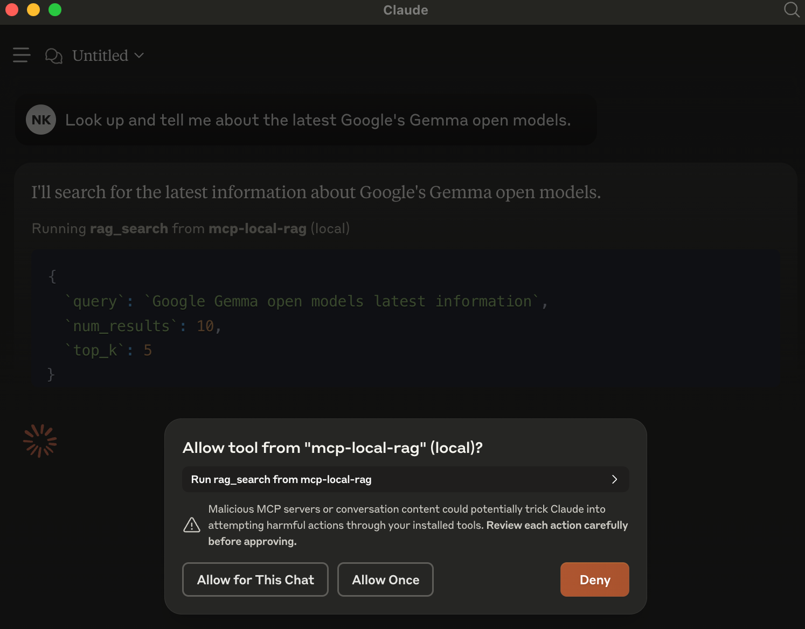
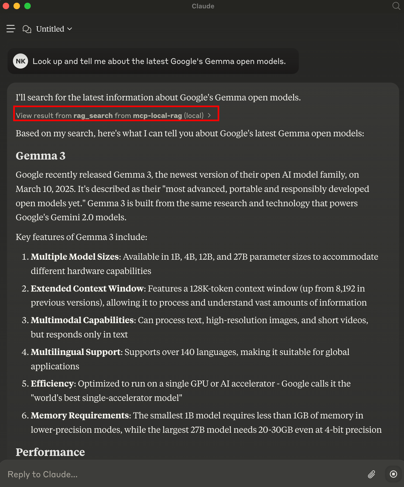

<a href='https://github.com/nkapila6/mcp-local-rag/'></a>

# mcp-local-rag
"primitive" RAG-like web search model context protocol (MCP) server that runs locally. ✨ no APIs ✨ 


# Installation instructions
1. You would need to install ```uv```: https://docs.astral.sh/uv/

## If you do not want to clone in Step 2.
Just paste this directly into Claude config. You can find the configuration paths here: https://modelcontextprotocol.io/quickstart/user
```json
{
    "mcpServers": {
        "mcp-local-rag":{
            "command": "uvx",
            "args": [
            "--python=3.10",
            "--from",
            "git+https://github.com/nkapila6/mcp-local-rag",
            "mcp-local-rag"
            ]
        }
    }
}
```

## Otherwise:
2. Clone this GitHub repository (OPTIONAL, can be skipped with above config)
```terminal
git clone https://github.com/nkapila6/mcp-local-rag
```

3. Add the following to your Claude config. You can find the configuration paths here: https://modelcontextprotocol.io/quickstart/user
```json
{
  "mcpServers": {
    "mcp-local-rag": {
      "command": "uv",
      "args": [
        "--directory",
        "<path where this folder is located>/mcp-local-rag/",
        "run",
        "src/mcp_local_rag/main.py"
      ]
    }
  }
}
```

# Security audits
<a href='https://mseep.ai/app/nkapila6-mcp-local-rag'></a>

# Example use

## On prompt
When asked to fetch/lookup/search the web, the model prompts you to use MCP server for the chat.

In the example, have asked it about Google's latest Gemma models released yesterday. This is new info that Claude is not aware about.


## Result
The result from the local `rag_search` helps the model answer with new info.

